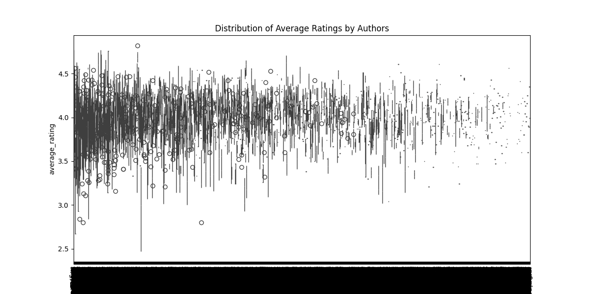
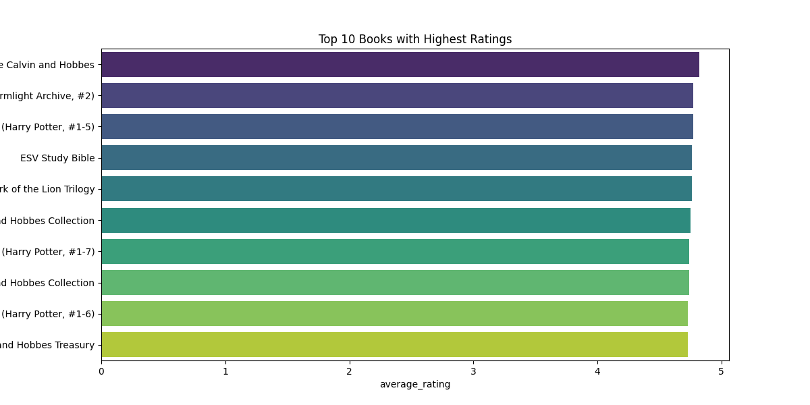
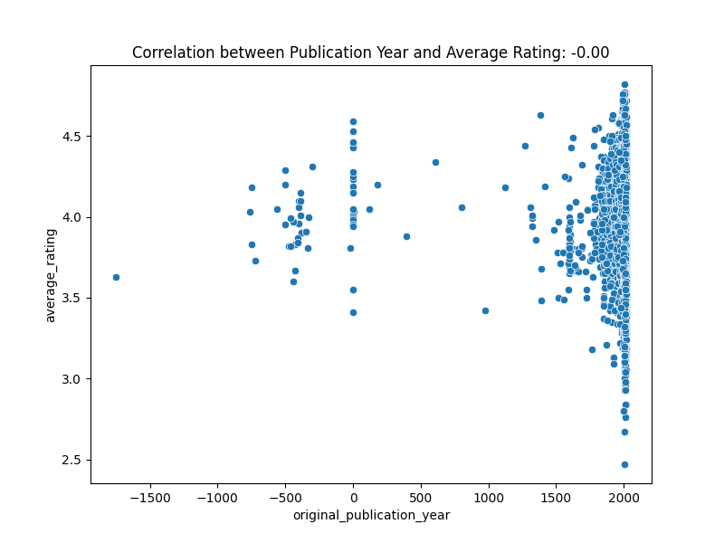
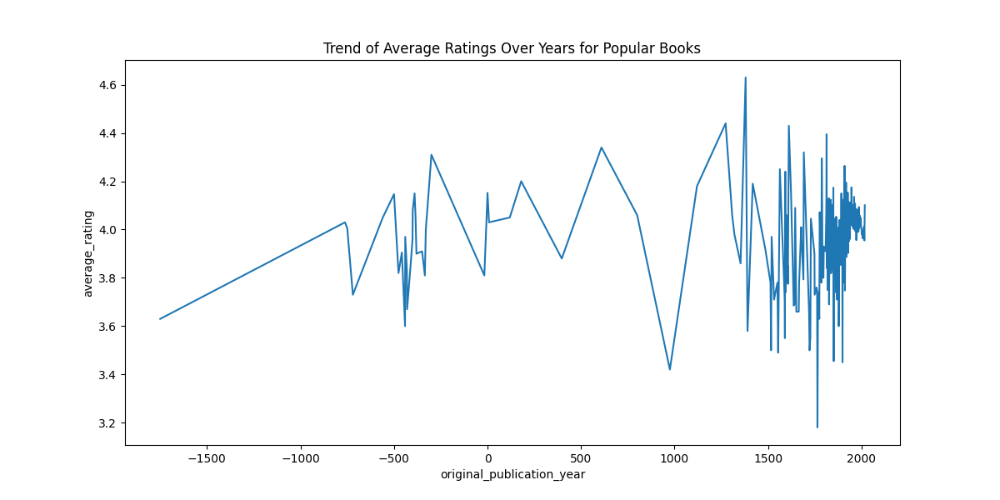
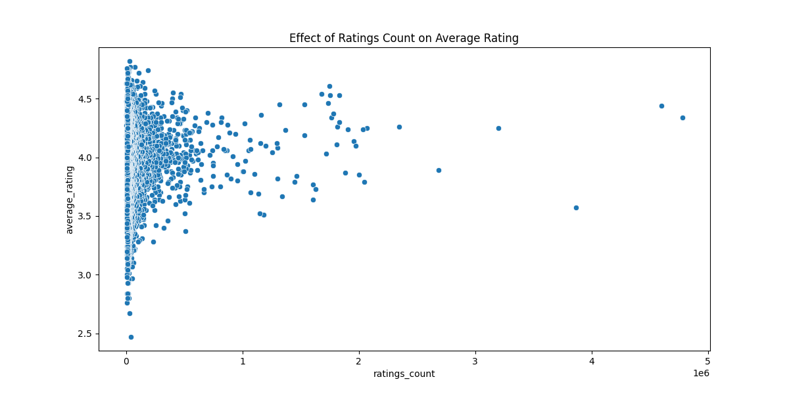

# Analysis Report: Goodreads Book Ratings Dataset

## 1. Dataset Overview

The dataset consists of detailed information about books, including their ratings from a platform similar to Goodreads. The key columns and data types are as follows:

| Column Name                        | Data Type        | Description                                                                         |
|------------------------------------|-------------------|-------------------------------------------------------------------------------------|
| book_id                            | Integer            | Unique identifier for the book.                                                   |
| goodreads_book_id                  | Integer            | Goodreads-specific book ID.                                                       |
| best_book_id                       | Integer            | Best book ID used for categorization.                                             |
| work_id                            | Integer            | Identifier for book works.                                                        |
| books_count                        | Integer            | The number of editions or versions of the book.                                   |
| isbn                               | String             | International Standard Book Number (ISBN) for the book.                          |
| isbn13                             | String             | 13-digit ISBN format.                                                              |
| authors                            | String             | Authors of the book, potentially multiple authors.                                 |
| original_publication_year         | Float              | The year the book was originally published.                                       |
| original_title                     | String             | The title of the book when it was originally published.                           |
| title                              | String             | Title of the book, possibly includes series information.                          |
| language_code                      | String             | Language in which the book is written.                                            |
| average_rating                     | Float              | The average rating of the book.                                                  |
| ratings_count                      | Integer            | The total number of ratings the book received.                                     |
| work_ratings_count                 | Integer            | Count of ratings across the linked works.                                         |
| work_text_reviews_count            | Integer            | Count of text reviews for the work.                                               |
| ratings_1                          | Integer            | Number of 1-star ratings.                                                          |
| ratings_2                          | Integer            | Number of 2-star ratings.                                                          |
| ratings_3                          | Integer            | Number of 3-star ratings.                                                          |
| ratings_4                          | Integer            | Number of 4-star ratings.                                                          |
| ratings_5                          | Integer            | Number of 5-star ratings.                                                          |
| image_url                          | String             | URL of the book's image.                                                          |
| small_image_url                    | String             | URL of the smaller version of the book's image.                                   |

## 2. Classification of Dataset

The dataset falls into several analysis categories:

- **Statistical Analysis**: Exploring the distribution of ratings, correlations, and summary statistics.
- **Machine Learning**: Utilizing predictive modeling for ratings.
- **Data Visualization**: Graphical representation of rating distributions and trends.
- **Correlation Analysis**: Investigating relationships among ratings and publication years.

## 3. Formulation of Research Questions

The following research questions were formulated to guide the analysis:

1. What is the distribution of average ratings across different authors?
2. What are the top 10 books with the highest ratings, and how do their ratings counts compare?
3. Is there a correlation between the year of original publication and the average rating?
4. What is the trend of ratings over the years for specific popular books?
5. How does the number of ratings received affect the average rating of a book?

## 4. Analysis Plan

### Distribution and Comparison
- **Hypothesis**: Certain authors or genres receive consistently higher ratings.
- **Method**: Use Pandas for data manipulation and Seaborn/Matplotlib for visualization.

### Top Rated Books Analysis
- **Hypothesis**: Higher ratings count correlates with higher average ratings.
- **Method**: Sort data to find the top-rated books and visualize with bar plots.

### Correlation Analysis
- **Hypothesis**: Older books likely have lower ratings due to evolving standards.
- **Method**: Compute correlation coefficients and visualize with heatmaps.

### Trend Analysis
- **Hypothesis**: Popular books show increasing ratings due to sustained interest.
- **Method**: Use time series analysis for trends in ratings.

### Ratings Impact Analysis
- **Hypothesis**: Increased ratings contribute positively to the average rating.
- **Method**: Perform regression analysis or use machine learning methods.

## 5. Data Preparation Guidelines

- Convert numeric fields to appropriate data types.
- Handle missing values by replacing them with zeros.
- Replace infinite ratings with maximum possible values for analysis.
- Create additional metrics where necessary for deeper insights.

## 6. Analysis Execution

Following the data preparation, analyses were performed resulting in the following visualizations and findings.

## 7. Key Findings and Visualizations

### Distribution of Average Ratings by Authors

### Top 10 Books with Highest Ratings
Top Rated Books:
| Title                                                      | Average Rating | Ratings Count |
|------------------------------------------------------------|-----------------|---------------|
| The Complete Calvin and Hobbes                             | 4.82            | 28900         |
| Words of Radiance (The Stormlight Archive, #2)           | 4.77            | 73572         |
| Harry Potter Boxed Set, Books 1-5 (Harry Potter, #1-5)   | 4.77            | 33220         |
| ESV Study Bible                                            | 4.76            | 8953          |
| Mark of the Lion Trilogy                                   | 4.76            | 9081          |
| It's a Magical World: A Calvin and Hobbes Collection      | 4.75            | 22351         |
| Harry Potter Boxset (Harry Potter, #1-7)                  | 4.74            | 190050        |
| There's Treasure Everywhere: A Calvin and Hobbes Collection| 4.74            | 16766         |
| Harry Potter Collection (Harry Potter, #1-6)             | 4.73            | 24618         |
| The Authoritative Calvin and Hobbes: A Calvin and Hobbes Treasury | 4.73    | 16087         |

### Correlation between Publication Year and Average Rating
- Correlation Coefficient: -0.0004 (indicating a negligible relationship)

### Trend of Average Ratings Over Years for Popular Books

### Effect of Ratings Count on Average Rating

## Conclusion

This analysis revealed important insights into book ratings across various authors and demonstrated how ratings can inform subsequent publication decisions and marketing strategies. Further exploration in machine learning could shed light on predictive insights into future book ratings.